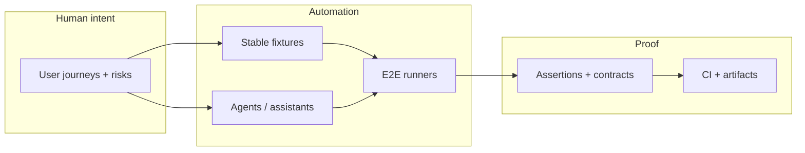

<div align="center">

<!-- Typing headline — https://github.com/DenverCoder1/readme-typing-svg -->
[](https://github.com/barbashaman)

**I’m figuring out how end-to-end automation, human intent, and agent-assisted exploration can fit together without pretending we’ve “solved” quality — one experiment, one flaky test, and one honest retro at a time.**

[](https://github.com/barbashaman)
[](https://www.linkedin.com/in/matheus-barbachan-e-silva-276241a1/)
[](mailto:matheus.barbachan@gmail.com)
[](https://www.instagram.com/barbashaman/)

</div>

---

### The short version

I work as an **SDET** and spend most of my curiosity budget on questions that sound dull until they aren’t: **how stable is this selector really?**, **what makes this data repeatable?**, **how fast can we learn from a red build?**, **can a stranger read this test and trust it?**  
I’m **experimenting with agentic workflows** — where LLMs might help explore or scaffold — and trying to stay skeptical about the hype: **when does it help, when does it lie, and what proof do we still owe the team?**

<details>
<summary><strong>🧪 Expand: what I’m probing when I say “agentic”</strong></summary>

I don’t use **agentic** to mean “hands off, the bot has it.” I’m interested in **splitting the work**: machines suggesting paths or boilerplate, humans keeping **intent, assertions, and contracts** visible.  
Open questions on my mind: how do we keep **traceability** honest (what ran, on what data, with what evidence)? what’s a sane **flakiness budget** when models are non-deterministic? how do failures stay **legible** so we learn instead of shrug?  
If you’ve wrestled with the same tensions, I’d love to compare notes — I’m still mapping this space.

</details>

<details>
<summary><strong>🥒 Expand: Gherkin as a thinking hat (rough draft)</strong></summary>

```gherkin
Feature: Visiting this profile
  As someone skimming GitHub
  I want an honest sense of how someone thinks
  So I can decide if a conversation might be useful

  Scenario: Curiosity over polish
    Given I land here with limited attention
    When I read the fold
    Then I get a feel for problems this person chews on
      And I see a way to say hello
      And nobody claims to have finished learning
```

*If that tone resonates, we’ll probably have a good thread.*

</details>

---

### What I’m exploring (heuristics, not commandments)

These are **lenses I keep trying on** — some days they hold, some days reality argues back. I’m always happy to be shown a better frame.

| Lens | Questions / experiments on my mind |
|------|-------------------------------------|
| **Earlier quality conversations** | Can we talk about risks and contracts while shapes are still cheap to change — without slowing discovery down? |
| **E2E scope** | Which journeys truly need the full stack, and which problems are better solved one layer down? |
| **Determinism vs. assistants** | Where does non-determinism belong, and where do we still need boring, repeatable proof? |
| **Signals from failures** | Do traces and artifacts actually shorten the path from red to “we know why”? |
| **CI as a feedback loop** | Is this pipeline helping the team learn, or just generating noise? |

---

### Stack & tooling

<p align="center">
  
</p>

<details>
<summary><strong>🧰 Legacy stack view (same tools, icon grid)</strong></summary>

**Languages:** Java · Python · JavaScript · TypeScript · C# · Lua  
**Runtimes & platforms:** Node.js · Linux · Windows · Android-oriented testing contexts  
**Databases:** Oracle · MongoDB  
**Day-to-day:** PyCharm · IntelliJ · VS Code · Git · Terminal-first workflows  

</details>

---

### Agentic E2E — a sketch I keep redrawing

When I need to **untangle** intent, automation, and proof, I reach for something like this — **a draft**, not a finished architecture:



---

### If you want to connect

I’m **open to collaboration and conversation** on automation frameworks, **E2E** direction, **BDD** in messy real teams, and **AI-assisted** testing where governance and learning still matter.  
I don’t have a fixed “only these topics” list — I like **spelunking** new stacks and ideas when someone brings a concrete problem.

**Outside work:** test automation, how ML/AI intersects with quality, languages and patterns I haven’t tried yet, and **what actually holds up** after the blog posts age out.

<div align="center">

**Say hi on [LinkedIn](https://www.linkedin.com/in/matheus-barbachan-e-silva-276241a1/) or [email](mailto:matheus.barbachan@gmail.com) — I’m happiest swapping questions, war stories, and half-baked theories.**

<sub>Built with GitHub-flavored Markdown: collapsible bits and Mermaid — tweak or rip out anything that doesn’t fit you.</sub>

</div>
