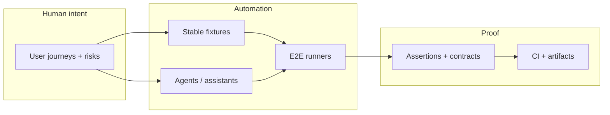

<div align="center">

<!-- Typing headline — https://github.com/DenverCoder1/readme-typing-svg -->
[](https://github.com/barbashaman)

**I design and ship end-to-end test systems where humans set intent, agents explore paths, and pipelines keep everyone honest.**

[](https://github.com/barbashaman)
[](https://www.linkedin.com/in/matheus-barbachan-e-silva-276241a1/)
[](mailto:matheus.barbachan@gmail.com)
[](https://www.instagram.com/barbashaman/)

</div>

---

### The short version

I'm an **SDET** obsessed with the boring magic: **reliable selectors**, **deterministic data**, **fast feedback**, and **tests that read like documentation**. Lately that means leaning into **agentic workflows** — LLM-assisted exploration, self-healing where it actually helps, and guardrails so automation stays **trustworthy**, not theatrical.

<details>
<summary><strong>🧪 Expand: what I mean by “agentic” (no hype, just engineering)</strong></summary>

**Agentic** here isn’t “replace QA.” It’s **orchestration**: agents propose steps, generate scaffolding, or explore state space — while **assertions, contracts, and CI gates** stay explicit and owned by the team. I care about **traceability** (what ran, on what data, with what evidence), **flakiness budgets**, and **human-readable failure stories** so releases stay boring in the best way.

</details>

<details>
<summary><strong>🥒 Expand: my brain on Gherkin (sample scenario)</strong></summary>

```gherkin
Feature: Profile README first impression
  As a visitor
  I want signal without noise
  So I know if we should talk about test strategy

  Scenario: The README earns a second scroll
    Given I land on barbashaman's GitHub profile
    When I skim the fold
    Then I see a clear SDET niche
      And I see how to reach out
      And I am not attacked by 200 broken logo hotlinks
```

*If this made you smile, we’ll get along.*

</details>

---

### How I work (industry-shaped, battle-tested)

| Pillar | What it looks like in practice |
|--------|--------------------------------|
| **Shift-left** | Tests and contracts discussed with design & API shape — not bolted on after merge |
| **E2E that scales** | Pyramid-aware: critical user journeys in full stack; everything else pushed to faster layers |
| **Determinism** | Stable data, idempotent setup, clocks and network under control — *especially* with AI in the loop |
| **Observability** | Traces, artifacts, and reports that answer “what broke?” and “where?” in one glance |
| **CI as product** | Fast PR signal, clear ownership of flakes, no mystery red builds |

---

### Stack & tooling

<p align="center">
  
</p>

<details>
<summary><strong>🧰 Legacy stack view (same tools, icon grid)</strong></summary>

**Languages:** Java · Python · JavaScript · TypeScript · C# · Lua  
**Runtimes & platforms:** Node.js · Linux · Windows · Android-oriented testing contexts  
**Databases:** Oracle · MongoDB  
**Day-to-day:** PyCharm · IntelliJ · VS Code · Git · Terminal-first workflows  

</details>

---

### Agentic E2E — mental model

When tooling gets noisy, this is the picture I keep in my head:



---

### GitHub pulse

<p align="center">
  
  
</p>

<p align="center">
  
</p>

---

### Let’s build something

- **Collaboration:** automation frameworks, **E2E** strategy, **BDD** at scale, and **AI-assisted** testing *with* governance  
- **Interests:** test automation, applied ML/AI for quality, polyglot engineering, and patterns that survive the next framework hype cycle  

<div align="center">

**Ping me on [LinkedIn](https://www.linkedin.com/in/matheus-barbachan-e-silva-276241a1/) or [email](mailto:matheus.barbachan@gmail.com) — always happy to trade notes on quality engineering.**

<sub>README crafted for GitHub-flavored Markdown: collapsible sections, Mermaid, and stats cards. Swap themes or remove widgets anytime.</sub>

</div>
